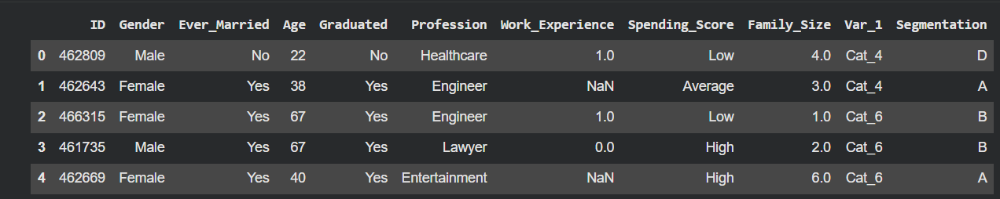
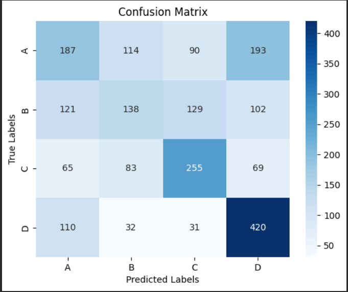
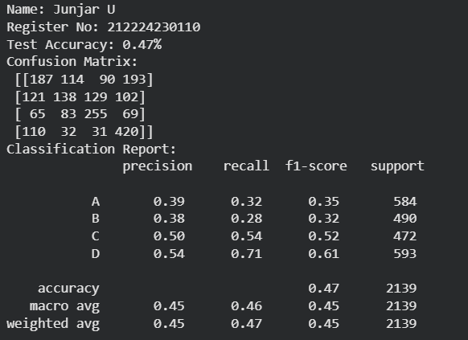
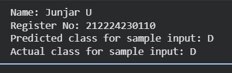

# Developing a Neural Network Classification Model

## AIM
To develop a neural network classification model for the given dataset.

## THEORY
An automobile company has plans to enter new markets with their existing products. After intensive market research, they’ve decided that the behavior of the new market is similar to their existing market.

In their existing market, the sales team has classified all customers into 4 segments (A, B, C, D ). Then, they performed segmented outreach and communication for a different segment of customers. This strategy has work exceptionally well for them. They plan to use the same strategy for the new markets.

You are required to help the manager to predict the right group of the new customers.

## Neural Network Model
Include the neural network model diagram.

## DESIGN STEPS
### STEP 1: 

Import required libraries and load the dataset into the program.

### STEP 2: 

Handle missing values, encode categorical variables, separate features (X) and target (y), and normalize the features.

### STEP 3: 

Divide the data into training and testing sets (e.g., 80% training, 20% testing).

### STEP 4: 

Create a neural network with input layer, hidden layers using ReLU activation, and an output layer for classification.

### STEP 5: 

Perform forward pass, compute loss using CrossEntropyLoss, apply backpropagation, and update weights using Adam optimizer for multiple epochs.

### STEP 6: 


Test the trained model on unseen data and calculate accuracy, confusion matrix, and classification report.


## PROGRAM


### Name: Junjar U

### Register Number: 212224230110

```python
class PeopleClassifier(nn.Module):
    def __init__(self, input_size):
        super(PeopleClassifier, self).__init__()
        #Include your code here
        self.fc1 = nn.Linear(input_size,32)
        self.fc2 = nn.Linear(32,16)
        self.fc3 = nn.Linear(16,8)
        self.fc4 = nn.Linear(8,4)


    def forward(self, x):
        #Include your code here
        x = F.relu(self.fc1(x))
        x = F.relu(self.fc2(x))
        x = F.relu(self.fc3(x))
        x = self.fc4(x)
        return x
        
# Initialize the Model, Loss Function, and Optimizer

def train_model(model, train_loader, criterion, optimizer, epochs):
    #Include your code here
  model.train()
  for epoch in range(epochs):
    for inputs, labels in train_loader:
      optimizer.zero_grad()
      outputs = model(inputs)
      loss = criterion(outputs, labels)
      loss.backward()
      optimizer.step()

    if (epoch + 1) % 10 == 0:
        print(f'Epoch [{epoch+1}/{epochs}], Loss: {loss.item():.4f}')
model = PeopleClassifier(input_size = X_train.shape[1])
criterion = nn.CrossEntropyLoss()
optimizer = optim.Adam(model.parameters(), lr=0.001)
train_model(model, train_loader, criterion, optimizer, epochs=100)
model.eval()
predictions, actuals = [], []
with torch.no_grad():
    for X_batch, y_batch in test_loader:
        outputs = model(X_batch)
        _, predicted = torch.max(outputs, 1)
        predictions.extend(predicted.numpy())
        actuals.extend(y_batch.numpy())
# Compute metrics
accuracy = accuracy_score(actuals, predictions)
conf_matrix = confusion_matrix(actuals, predictions)
class_report = classification_report(actuals, predictions, target_names=[str(i) for i in label_encoder.classes_])
print("Name: Junjar U")
print("Register No: 212224230110")
print(f'Test Accuracy: {accuracy:.2f}%')
print("Confusion Matrix:\n", conf_matrix)
print("Classification Report:\n", class_report)
import seaborn as sns
import matplotlib.pyplot as plt
sns.heatmap(conf_matrix, annot=True, cmap='Blues', xticklabels=label_encoder.classes_, yticklabels=label_encoder.classes_,fmt='g')
plt.xlabel("Predicted Labels")
plt.ylabel("True Labels")
plt.title("Confusion Matrix")
plt.show()
# Prediction for a sample input
sample_input = X_test[12].clone().unsqueeze(0).detach().type(torch.float32)
with torch.no_grad():
    output = model(sample_input)
    # Select the prediction for the sample (first element)
    predicted_class_index = torch.argmax(output[0]).item()
    predicted_class_label = label_encoder.inverse_transform([predicted_class_index])[0]
print("Name: Junjar U")
print("Register No: 212224230110")
print(f'Predicted class for sample input: {predicted_class_label}')
print(f'Actual class for sample input: {label_encoder.inverse_transform([y_test[12].item()])[0]}')
```

### Dataset Information <br>
Include screenshot of the dataset.

### OUTPUT

## Confusion Matrix <br>



## Classification Report <br>



### New Sample Data Prediction <br>

## RESULT
Thus, the neural network classification model was successfully developed and trained using PyTorch.
